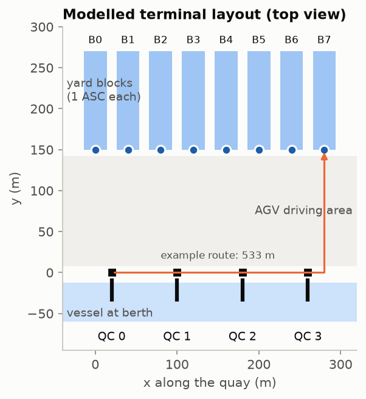
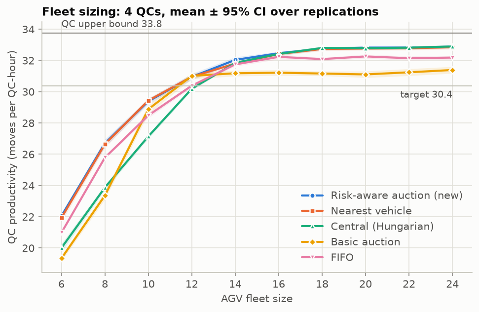
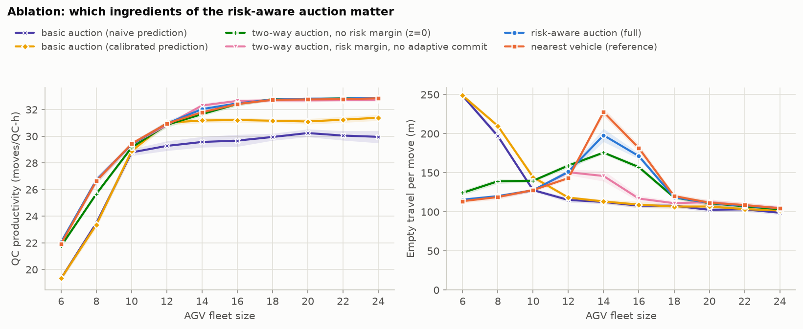
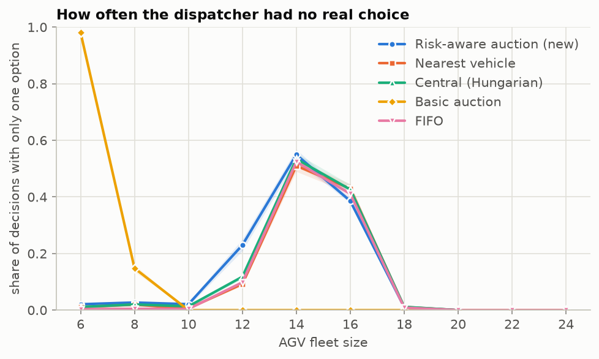
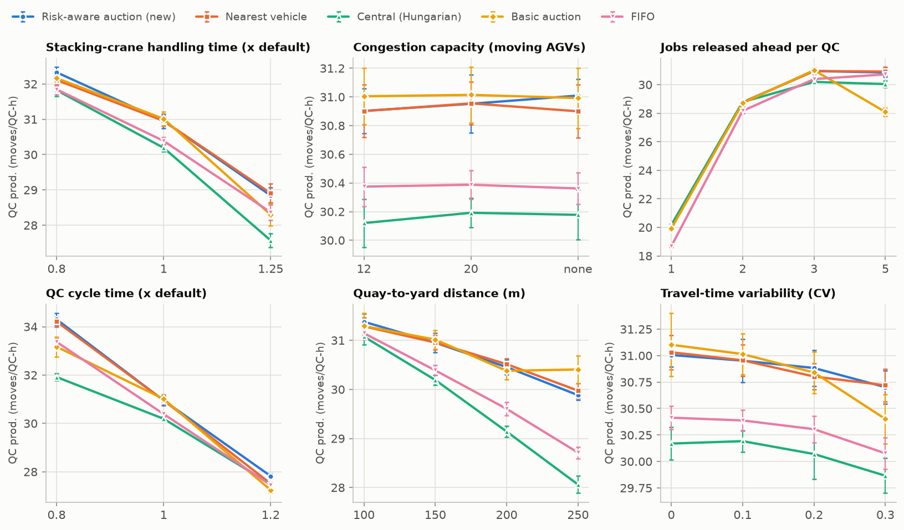

# Risk-Aware AGV Dispatching at an Automated Container Terminal

A discrete-event simulation (Python + SimPy) of the waterside of an automated container terminal, and a new
**risk-aware two-way auction** for dispatching its automated guided vehicles (AGVs).

Quay cranes (QCs) unload and load a vessel; AGVs carry containers between the quay and the yard; automated
stacking cranes (ASCs) serve the yard blocks. A crane can only hand a box over when an AGV is underneath it,
so AGV dispatching directly limits how fast the ship is worked. The study answers two questions:

1. **Fleet sizing:** how many AGVs keep 4 quay cranes at ≥ 90 % of their productivity?
2. **Control:** can AGVs negotiate jobs among themselves (a Contract-Net auction) as well as a central
   controller assigns them, at every fleet size?

**Report:** [`report/report.pdf`](report/report.pdf) · **Guide:** [`docs/PROJECT_GUIDE.md`](docs/PROJECT_GUIDE.md) · **Changes:** [`CHANGELOG.md`](CHANGELOG.md)



## Policies

| Policy | Who decides | Idea |
|---|---|---|
| `fifo` | central | oldest job → longest-idle AGV (baseline) |
| `nearest` | central, greedy | shortest empty drive first (Egbelu & Tanchoco, 1984) |
| `central` | central optimiser | Hungarian assignment of idle AGVs, minimising predicted crane hand-over time + empty travel |
| `auction` | decentralised | each crane announces its next job; AGVs bid their own predicted hand-over time (Contract Net, Smith 1980) |
| **`auction_ra`** (new) | decentralised | **two-way** (the scarce side announces), **risk margin** learned from past prediction errors, **adaptive commitment** (busy AGVs only pre-commit when they can be on time and no idle AGV can) |

## Results (10 vessel calls per point, common random numbers, mean ± 95 % CI)



* **Fleet sizing:** 12 AGVs (3 per crane) reach 90 % of crane capacity with the new auction, nearest vehicle or
  the basic auction; the central controller needs 14. For 95 %, 16 AGVs are needed.
* **New auction vs. the best benchmark:** never significantly worse at any fleet size from 6 to 24. At 14 AGVs it
  beats nearest vehicle by **+0.23 ± 0.14 moves/QC-h** with **13 % less empty driving**; it beats the central
  controller by **0.8–2.8 moves/QC-h** with 6–12 AGVs.
* **Why the basic auction fails:** it commits jobs to busy AGVs using over-confident arrival predictions. It loses
  up to 3.3 moves/QC-h with few AGVs and ~1.5 with many; the two-way rule and learned risk margin fix both.
* **Why empty driving peaks at 14 AGVs:** supply ≈ demand, so about half of all dispatch decisions have only one
  option (see `fig_fleet_choices.png`).
* The settings of the new auction (`risk_z = 2.5`, adaptive commitment on) were chosen on separate tuning seeds
  (101–110) with a worst-case-regret criterion, then frozen and evaluated on seeds 1–10.

| | | |
|---|---|---|
|  |  |  |

## Run it

**Windows, one click:** open the folder in VS Code, open `run_all_windows.py` and press ▷ *Run Python File*.
It creates `.venv`, installs the packages, runs the tests and every experiment (about 5 min on a 12-core laptop)
and writes a log to `results/laptop_run_log.txt`.

**Any OS, step by step:**

```bash
python -m venv .venv
# Windows: .venv\Scripts\activate      macOS/Linux: source .venv/bin/activate
pip install -r requirements.txt
python -m pytest -q              # 23 verification tests
python run.py single             # one vessel call + Gantt chart
python run.py all --quick        # every experiment, small (~1 min)
python run.py all --step 2       # every experiment, full size (fleet sweep, sensitivity, ablation, tuning)
python report/make_tables.py     # LaTeX tables for the report
python run.py fleet --set quay_to_yard_m=250 --out results/deep_yard   # change any parameter
```

## Project structure

```
config/default.yaml          every model parameter, with units
terminal_sim/config.py       parameter definitions and checks
terminal_sim/layout.py       geometry and travel times
terminal_sim/workplan.py     vessel work plan; all random draws up front (common random numbers)
terminal_sim/model.py        SimPy processes (quay cranes, AGVs, stacking cranes), predictions, KPIs
terminal_sim/dispatch.py     the five dispatching policies
terminal_sim/experiments.py  replications, confidence intervals, paired differences, experiment designs
terminal_sim/plots.py        figures
run.py                       command-line interface
run_all_windows.py           one-click runner for VS Code on Windows
publish_github.py            one-click publish to GitHub (git init, commit, push, tag)
tests/test_model.py          23 verification tests (incl. a hand-calculated case)
report/                      report.tex, report.pdf, make_tables.py, tables/
docs/PROJECT_GUIDE.md        how the project was done, parameter sources, write-up kit
results/                     figures (PNG) and summary tables (CSV)
```

## Verification and validation

* Tests: hand-calculated deterministic case for every policy, job conservation and crane sequence, no deadlock,
  common random numbers, reproducibility, crane upper bound, time accounting.
* The whole experiment set gives identical numbers on Linux and Windows 11.
* Simulated productivity saturates at ≈ 32.8 moves/QC-h, consistent with published simulation (≈ 34 with 16 AGVs
  for 4 QCs, Gerrits et al. 2018) and above the 22–30 gross moves/h reported for NW European terminals
  (Saanen et al. 2003), as expected for a model without landside work or breakdowns.

## Limitations

Single-load AGVs; traffic represented by a BPR congestion function rather than explicit lanes and collision
avoidance; random yard-block allocation; no battery charging; no buffer lanes or lift-AGVs; one vessel and no
landside trucks; ASCs do not pre-fetch; several parameters are assumptions (see the guide).

## References

* Steenken, D., Voß, S., Stahlbock, R. (2004). Container terminal operation and operations research – a classification and literature review. *OR Spectrum* 26(1), 3–49.
* Le-Anh, T., De Koster, M.B.M. (2006). A review of design and control of automated guided vehicle systems. *EJOR* 171(1), 1–23.
* Egbelu, P.J., Tanchoco, J.M.A. (1984). Characterization of automatic guided vehicle dispatching rules. *IJPR* 22(3), 359–374.
* Smith, R.G. (1980). The Contract Net Protocol. *IEEE Transactions on Computers* C-29(12), 1104–1113.
* Grunow, M., Günther, H.-O., Lehmann, M. (2004). Dispatching multi-load AGVs in highly automated seaport container terminals. *OR Spectrum* 26(2), 211–235.
* Xin, J., Negenborn, R.R., Lodewijks, G. (2014). Energy-aware control for automated container terminals using integrated flow shop scheduling and optimal control. *Transportation Research Part C* 44, 214–230.
* Gerrits, B., Mes, M., Schuur, P. (2018). A simulation model for the planning and control of AGVs at automated container terminals. *Winter Simulation Conference*.
* Saanen, Y., van Meel, J., Verbraeck, A. (2003). The design and assessment of next generation automated container terminals. *European Simulation Symposium*.
* Watson, J. (2005). Comparison of three automated stacking alternatives by means of simulation. TBA white paper.
* Jordan, M.A. (2002). Quay crane productivity. Liftech Consultants.
* Saputra, R.P., Rijanto, E. (2021). Automatic guided vehicles system and its coordination control for containers terminal logistics application. arXiv:2104.08331.

Author: Anwesh Ajitabh Dash · Python 3, SimPy, NumPy, SciPy, pandas, Matplotlib.
